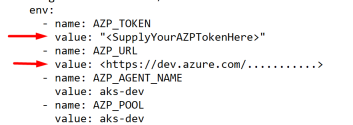

# kubernetes-azure-devops-dragdrop
An small node-js app triggering a small Azure-Devops pipeline to deploy multiple HELM-Charts into any Kubernetes cluster.  
In this example it is deploying to an AWS-EKS and an Azure-AKS cluster at the same time. Dragging a HELM-Chart from one cloud to another.  
 
This is done by deploying Azure-Devops agents in the clusters itself. In 4 namespaces there are 4 Azure-Devops agents running.  
Each agent is running in another agent-pool allowing for choice where to deploy.  
 

 
Try this yourself (you can also run this on minikube with 4 namespaces)  
 
<<<<<<< HEAD
1) Azuredevops  

-Create an Azure-devops organization, add a project and within the project add a repo  
-Add all the files from the folder azure-devops-charts-repo to that repo  
   
-Create a pipeline. The code for the pipeline in is the same folder (azure-pipelines.yml)  
-Create 3 variables in the pipeline: helmaction, helmchart and mypool  
-Note the pipelineid number in the url link (see image below).  

-Create 4 agent pools (eks-dev, eks-tst, aks-dev and aks-tst)

-Create an access token

  

2) 
Kubernetes  

-Create 4 namespaces either in 2 K8s clusters (AWS, EKS, GKE) or in minikube or wherever. See the K8s-yamls folder  
-Extend the rights of the default account so that that account can deploy resources in the namespaces (rights.yaml) 

-Deploy the az-devops-agent yamls but make sure the values there are filled in: 

Optionally build your own dockerfile for azdevops agent (see ...docker-image folder)
=======
1) Create an Azure-devops organization add a project and within the project add a repo  
   Add all the files from the folder azure-devops-charts-repo to that repo  
   Create a pipeline. The code for the pipeline in is the same folder (azure-pipelines.yml)  
   Create 3 variables in the pipeline: helmaction, helmchart and mypool  
   note the pipelineid number in the url link (see image below). With your pipeline this will be a different number probably  
   

>>>>>>> cfb99654c3b7d27d1d749df354d9d9c8afd481c4
 
3)
The dragdrop app  
On the environment where you run the app set these env vars:

API_PROJECT = *enter azure devops projectname*  
API_PIPELINEID = *the pipeline id you noted at step 1* 
API_TOKEN = *enter azure devops API token that has rights to trigger pipeline*  
API_URL = HTTPS://dev.azure.com/*yourazdevopsorg*  
TOKEN = *a password/token used in the app that is checked when triggering pipeline. Just set this to 'something' and enter the same in the gui*  

Install npm / nodejs

from the dragdrop-app folder open a command prompt:
npm i
npm start

then goto localhost:3000 
Make sure you enter the token here before drag and dropping:

That should be it.
Let me know if there is an issue
